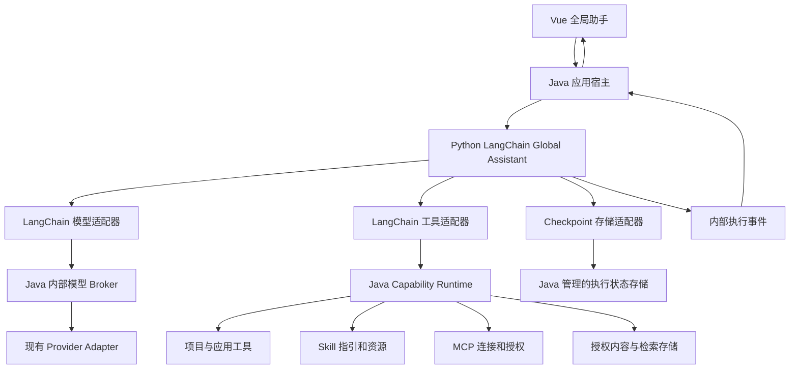

# 全局助手 LangChain 改造设计与实施交接

> 日期：2026-10-01（Asia/Shanghai）
> 状态：目标设计，待分阶段实现；本次仅修改文档，不表示功能已实现或模型兼容性已验证。
> 范围：应用级 Global Assistant；不迁移 Project Agent，不改变 Graph 核心语义。
> 用户方向：更多采用 LangChain 的标准机制，迁移自写 Agent 编排，并增加 Skill 使用、MCP、知识检索和应用查询能力。
> 新会话入口：先阅读本文，按 §16 从阶段 0 开始开发；执行约束见 §1、§17。

> 开发进度：见 [GLOBAL_ASSISTANT_LANGCHAIN_IMPLEMENTATION_STATUS.md](GLOBAL_ASSISTANT_LANGCHAIN_IMPLEMENTATION_STATUS.md)。沿用已完成阶段 0 工作；阶段 1 已接通真实模型正文流、Java 宿主 RPC、产品生命周期及受控读写代表链。真实 Git 故障窗口、长期摘要与生产验收仍待补齐，不表示整阶段完成；未切换生产引擎。

> **2026-10-01 RAG 职责整合：** [UNIFIED_PYTHON_RAG_DESIGN.md](UNIFIED_PYTHON_RAG_DESIGN.md) 是 RAG/embedding 的最新目标。RAG 算法和真实本地 embedding 迁入共享 Python 模块，两个 Agent 共用；Java 保留事实、权限与索引存储。已取代本文原先“先新增 Java OllamaEmbeddingGateway”的迁移选择。正在进行的阶段 0 增量同步新契约，无需重做已有全局助手框架验证。

## 1. 文档地位与变更范围

本文是全局助手下一阶段的目标设计。`GLOBAL_ASSISTANT_IMPLEMENTATION_PLAN.md` 与 `GLOBAL_ASSISTANT_PHASE0_FREEZE.md` 继续描述已实现 V1 的基线；本文明确列出的变更仅在对应迁移阶段生效，不能把目标设计写成当前生产行为。

全局助手目标语义以本文为准；Graph、Project Agent、Provider transport、权限及历史约束仍以其 canonical 文档为准。实施前按阶段同步对应契约，不能借本文静默改写共享协议。

| 旧版约束 / 实现 | 目标变化 | 生效阶段 |
|---|---|---|
| Java 自写有界工具循环 | Python `create_agent` 成为全局助手唯一 Agent 循环 | 1 |
| 每轮 TOOL / CLARIFY / NAVIGATE / FINAL JSON 决策 | 框架工具调用、产品交互工具与最终消息 | 1 |
| 固定六项能力目录 | 经过宿主权限与范围筛选的能力目录 | 1–3 |
| 全局助手不使用 Skill / MCP | 支持应用级已启用 Skill、已授权 MCP | 3 |
| 全局助手无知识检索 | 增加产品帮助检索与受控项目内容检索 | 2、4 |
| 不自动恢复已中断运行 | 阶段 1 保留；阶段 4 才支持经过验证的受控恢复 | 4 |

继续保留：应用助手与项目需求 Agent 分工；Java 管理业务事实与权限；Python 不持有供应商凭证、不直接访问生产业务数据库；不可变 Answer、lineage 隔离、共享节点身份和来源追踪；已有公开聊天/SSE 行为的兼容性。

此次授权是设计文档编写，不是生产发布、提交推送或分支创建授权。当前检查到的 checkout 为 `main`，遵循 AGENT.md 当前主分支规则，不依据历史专项分支例外新建分支。

## 2. 现状证据

以下为本次只读审计确认的代码，实施阶段 0 必须重新检查，不能假定文件始终不变。

| 位置 | 当前行为 |
|---|---|
| `backend/.../assistant/runtime/GlobalAssistantRuntime.java` | Java 执行模型决策、工具循环、结果观察、取消和终态处理 |
| `backend/.../assistant/model/GlobalAssistantBrain.java` | 调用 Java ModelInferenceGateway，生产决策输出为 JSON_OBJECT |
| `backend/.../assistant/model/GlobalAssistantPromptRenderer.java` | 拼装应用上下文、最近历史、摘要、工具描述与观察 |
| `backend/.../assistant/tool/GlobalAssistantToolCatalog.java` | 六项：project.create、project.search、project.list_recent、project.get_summary、skill.import、skill.import.discover |
| `backend/.../assistant/tool/GlobalAssistantCatalogService.java` | 显式允许 ID + APPLICATION:GLOBAL_ASSISTANT 标记过滤，模型目录上限 8 |
| `backend/.../assistant/runtime/GlobalAssistantRuntimeProperties.java` | 当前 maxSteps=6、maxToolCalls=5 |
| `backend/.../assistant/tool/GlobalProjectSearchService.java` | 项目标题词法匹配，未检索项目内容 |
| `backend/.../assistant/tool/GlobalProjectSummaryQueryService.java` | 基础元数据、路线/节点数量、是否有规格；不是需求正文摘要 |
| `backend/.../assistant/runtime/GlobalAssistantRunRecoveryService.java` | 重启后中断旧运行，不自动重放工具；恢复待交接用户消息 |
| `frontend/src/features/global-assistant/` | 会话库、工具活动、资源卡片、流式回答、停止/steer 与事件重放 |
| `agent-brain/pyproject.toml` | 已有 Python >=3.11、FastAPI/httpx/Pydantic，未引入 LangChain |
| `agent-brain/src/spec_agent_brain/model_client/base.py` | Python 客户端角色仅 system/user，返回文本补全 |
| `backend/.../model/contract/ModelInferenceMessage.java` | role + content 文本消息，尚无工具调用字段 |
| `backend/.../skill/runtime/SkillActivateHostTool.java` | 已有 Skill 激活能力，但要求项目上下文，不能直接给全局助手使用 |
| `backend/.../capability/`、`skill/`、`mcp/`、`connection/` | 已有能力注册、Skill 资源、MCP 与连接平台，应复用 |

**2026-10-01 补充审计：项目 Agent 已有检索基础，不得从零重建。** 原审计只覆盖全局助手入口，遗漏了 `backend/src/main/java/com/specagent/retrieval/`。项目侧已有 source projection/resource chunk、lexical/trigram/graph/optional-vector 混合检索、RRF、来源与范围筛选，且已接入 AgentInputSnapshotBuilder；`memory.search` 提供显式项目检索。`V40__retrieval_runtime.sql` 已声明 pgvector/pg_trgm 与 `retrieval_entries`。代码中 EmbeddingGateway 目前只有 noop/fake 实现，默认 noop 不生成向量；fake 是内容哈希测试向量，不提供真实语义检索。数据库迁移是否在当前运行实例执行、真实索引量和检索效果仍需实测。上述已有基础与全局助手尚未开放该能力是两回事。详见 `AGENT_MEMORY_RAG_V1_IMPLEMENTATION.md`。

课程参考项目：`E:\project\AI大模型RAG与Agent智能体开发项目\代码\AI大模型RAG与智能体开发_Agent项目`。借鉴其 create_agent、工具、中间件和检索组织方式；不复制领域提示词、随机用户/月度模拟、固定天气、仅提示词限制循环和 MD5 账本式版本管理。它的 UI 聊天历史也没有作为完整历史传入每次执行，不能直接作为生产记忆方案。

## 3. 产品目标与边界

全局助手负责“理解用户的应用操作意图，查询可信资料，使用授权能力，完成应用级操作”。

目标场景：

1. 搜索项目、读取概要、打开项目；创建项目后根据用户目标决定是否打开。
2. 连续理解“第二个 / 刚才那个”，但用工具核验当前业务状态。
3. 回答产品使用问题，提供可点击来源；结合状态工具解释具体应用问题。
4. 查询连接状态、已发现能力与脱敏故障信息。
5. 按任务加载已启用 Skill 的过程指引和资源，调用允许的工具。
6. 使用应用范围内已配置、已授权的 MCP tools/resources/prompts。
7. 按内容定位项目和相关节点，返回来源、项目与路线位置。

范围不包含：任意文件系统/shell/浏览器访问、多 Agent 自我聊天、后台自主任务、通用知识库平台、长期人格记忆、需求 Graph 写操作或代替 Project Agent 生成规格。资料检索服务于 Spec Agent 产品帮助与工作区定位，不改变整个产品定位。

项目搜索可以发现多个项目的线索；这不意味着把多个项目或兄弟路线结论融合成一个项目的“已确认事实”。

## 4. LangChain 采用范围

目标是在框架上配置产品行为，新增能力不再修改核心 Agent 循环。

| 机制 | 采用方式 | 自定义代码边界 |
|---|---|---|
| Agent loop | `langchain.agents.create_agent` | 不再实现另一套 Python/Java ReAct while loop |
| Messages / tools | LangChain 消息、Tool/StructuredTool 与参数验证 | 描述符转换、宿主 RPC、业务规则 |
| Prompt | 模板 + 动态提示词中间件 | 产品身份、来源要求、Skill 指引装配 |
| Limits | 框架模型/工具调用限制 | 宿主持久化计数、总时限、重复无进展检测 |
| Summary | 框架摘要中间件 | 明确哪些身份与引用不得摘要丢失 |
| State | LangGraph checkpoint/state | 宿主存储桥接、租约与事件关联 |
| Streaming | 框架消息/更新/custom stream | 转换为稳定产品事件，不泄露内部报文 |
| Retrieval | 共享 Python LangChain loader、splitter、OllamaEmbeddings、retriever/vector-store 接口与融合 | Java 内容授权、版本、索引存储 RPC 与引用校验；详见统一 RAG 设计 |
| Human interaction | 框架 interrupt / 适用的人工介入机制 | Java 决定是否需要审批、审批与恢复授权 |

框架文档依据（核对日期 2026-10-01）：[Agents](https://docs.langchain.com/oss/python/langchain/agents)、[预置中间件](https://docs.langchain.com/oss/python/langchain/middleware/built-in)。create_agent 提供工具循环与配置入口；预置中间件包含摘要、模型/工具调用限制和人工介入。本文具体职责分工是本项目设计，不是框架自动提供的业务能力。

不默认启用框架自动模型重试、自动 provider fallback、LLM 工具选择器或额外 Critic。已有“无隐藏重试/降级”原则保持；新增模型调用必须有预算和效果依据。Deep Agents 的文件系统、子 Agent、通用任务管理不在本轮引入。

框架、模型适配器及底层 HTTP 客户端的隐式 retry 默认值也要逐一审计并关闭；不能只是不添加 RetryMiddleware 就认为没有重试。参数不合法可作为有界工具错误回到 Agent，重新决策计入预算；已经执行或结果未知的写操作不能按普通参数错误重试。

阶段 0 选择并锁定兼容的 LangChain/LangGraph 版本及依赖，记录 Python 3.11+、框架与适配器兼容矩阵；本文不假定具体未来版本 API。

## 5. 架构与职责



Java：身份、权限、运行生命周期、数据库事务、能力执行、来源核验、凭证、审批、事件序号、业务事实。Python：Agent 循环、消息、提示词、Skill 上下文、检索编排、框架执行状态。模型：选择下一步和生成回答；不决定权限和持久化资格。

在现有 agent-brain 进程增加独立 global_assistant 模块与入口；Project Agent 原有 `/v1/decisions`、state-update、artifact 路径保持。两者不共享业务推理状态、提示词或 checkpoint namespace。

Java 原循环退役后保留远程执行协调器，不保留“Python 失败就由旧 Java 循环再跑一次”的隐藏 fallback。

## 6. 模型接入与迁移前置门槛

标准 create_agent 工具调用不能直接套在当前文本 broker 上。阶段 0 必须验证真实供应商和所选模型的：tool schema、tool calls、assistant/tool 消息、tool_call_id、流式调用参数和结构化输出能力。

建议新增独立 `ga-model-inference.v1` 契约/入口（名称是目标，尚未存在），原 Project Agent 的 `model-inference.v1` 不原地扩展。契约使用 provider-neutral DTO：

- 请求：runId、executionEpoch、callId、受限 callType、modelBindingId、messages、tools、toolChoice、maxOutputTokens、流式选项。
- message：role、content，以及适用时的 toolCalls / toolCallId；禁止模型自行提交供应商 URL/header/key。
- 响应：文本、typed toolCalls、finishReason、usage；stream 使用有序 typed delta，工具参数必须完整校验后才执行。
- Java 验证运行仍有效、绑定模型与预算；Python bind_tools 将受控目录转换到此契约；供应商协议转换仍在 Java Provider Adapter。
- 每个 run 固定 modelBindingId，不能在中途切换设置后悄悄换模型；新 run 可以使用新设置。

兼容性处理：

1. 支持 native tool calling：采用标准 create_agent 路径，先完成最小端到端验收。
2. 不支持或冻结 transport 无法承载：报告 `UNSUPPORTED_AGENT_MODEL` / 明确的传输能力差距，不自动切换模型，不宣称迁移完成。
3. 如未来必须支持文本模拟调用，单独记录并审查模型适配契约和评估结果；不能为此偷偷再写一套 Agent 循环。本设计主路径不依赖此方案。

本文没有解除冻结的 OpenCode transport。阶段 0 需把真实差距、所需变更与兼容测试写入 MODEL_GATEWAY.md 对应新增契约章节及实施记录，遵循已有变更规则后再改传输。Python 不直接用供应商 SDK 持有 key 来绕过门槛。

## 7. 内部服务契约

以下为建议的目标路由，需在阶段 0 固化 DTO、错误码和测试样例；不能照表假定已有 API。

| 方向 | 路由 | 用途 |
|---|---|---|
| Java → Python | `POST /internal/v1/global-assistant/executions` | 启动已由 Java 创建的运行，接收执行事件流 |
| Java → Python | `POST /internal/v1/global-assistant/executions/{runId}/cancel` | 通知取消；权威取消状态仍在 Java |
| Java → Python | `POST /internal/v1/global-assistant/executions/{runId}/resume` | 阶段 3/4 的交互或恢复，需当前租约与有效令牌 |
| Python → Java | `POST /internal/v1/global-assistant/model-inference` | §6 模型推理 |
| Python → Java | `POST /internal/v1/global-assistant/capability-invocations` | 统一业务能力执行 |
| Python → Java | `POST /internal/v1/global-assistant/checkpoints/read`、`write` | 框架执行状态存储桥接 |

启动输入至少含：protocolVersion、threadId、runId、executionEpoch、当前消息 ID/内容、UI context、结构化引用、history boundary、已授权能力目录、策略版本、预算、modelBindingId。身份/权限从 Java 运行绑定解析，不信任 Python 自报的用户 ID 或 grantedPermissions。

内部请求使用现有内部认证机制，绑定运行范围；DTO 未知字段/版本 fail closed，限制体积和请求时长。GA run 与 Project Agent run 在验证器中显式区分，不能为接入 GA 而放宽原 broker 的运行类型校验。

执行事件含 runId、epoch、eventId、执行内序号、事件类型和有界 payload；Java 校验当前 epoch、去重并分配公开 sequence。网络断开先判断执行所有权，不创建第二个执行器。

产品 HTTP/SSE 路由保持；必要新增交互请求通过版本化 additive 契约接入，不让前端直接访问 Python。

## 8. 工具描述符、执行与交互

复用 CapabilityRegistry / CapabilityRuntime，不建立第二套业务工具注册表。流程：

```text
宿主筛选能力 → 生成有界描述符 → Python 生成 LangChain tools
→ 参数验证 → 宿主再次权限/状态校验 → CapabilityRuntime 执行
→ typed result + sourceRefs → ToolMessage → Agent 继续
```

现有 inputSchema 使用简化字段形式，不能假定已经是完整 JSON Schema。统一转换器需支持并验证必填/类型/枚举/嵌套/长度/unknown-key 规则；不支持的 schema 不可上架。

工具名必须映射为供应商可接受名称，保持双向表与唯一性；冲突 fail closed。描述符带版本/hash，执行时核验版本与权限，目录中没有的能力不可调用。

新增能力只需注册实现与描述符，不允许给核心 Agent 添加 `if message contains ...` 或业务领域分支。

初期默认顺序执行工具；有副作用或依赖的调用禁止并发。后续仅经过评估的独立只读调用可并行，宿主仍原子计数预算。

产品交互通过受控宿主工具实现：

- `ui.navigate`：typed destination + 可选 resourceId；沿用现有目标校验，产生 UI_ACTION 并返回执行结果。创建项目不默认导航。
- `assistant.request_user_input`：一个必要问题、可选候选引用；持久化后结束当前运行，下一条用户消息成为新 run；不把提问工具当作普通成功结果继续执行。
- 需要审批：宿主返回 typed APPROVAL_REQUIRED，框架中断；用户可审阅参数/目标，批准绑定 capabilityId、参数 hash、范围与版本。拒绝或过期结束待批准动作，修改参数重新校验。

这些 ID 是建议新增的应用能力，不是 Graph ActionFamily 扩展。阶段 1 不开放外部写操作，审批恢复在阶段 3 契约完备后启用；不得仅因中间件可用就自动批准。

## 9. 会话、记忆、checkpoint 与存储

| 数据 | 权威位置 | 规则 |
|---|---|---|
| 项目/路线/节点/答案 | Java Graph Runtime | 保持现有业务事实 |
| 可见消息、运行状态、公开事件 | Java conversation/run 仓库 | append-preserving，前端重放依据 |
| LangGraph 执行状态 | 独立 GA execution checkpoint 存储 | 可恢复执行材料，不是业务真相 |
| Skill 激活、工具调用、审批 | Java 宿主 | 可核验的历史与版本 |
| 检索索引 | 宿主管理的派生存储 | 可重建，不是项目事实 |

采用框架 checkpoint：[LangGraph Persistence](https://docs.langchain.com/oss/python/langgraph/persistence)。本项目通过 checkpoint saver 适配器访问 Java 管理的独立 GA 存储；不在 Python 新增生产数据库连接。这是针对现有 Python/DB 边界的存储适配，不能再实现一套图执行调度器。

建议独立存储概念：execution（run/epoch/lease/state）、checkpoint（namespace/id/parent/version/hash/payload）、checkpoint writes（任务中间写入）、交互审批引用。阶段 0 核对所选 saver 接口是否能完整承载 put/get/list/put_writes、分页及删除；明确大小限额、保留与清理规则，阶段 1 即使用持久存储，内存 saver 仅测试使用。

checkpoint 写入必须校验当前 lease/epoch 与 expectedVersion，旧执行器不能覆盖新状态；所有方法提供所选框架需要的异步支持。采用版本化、类型受限的序列化，不反序列化不受信任 pickle 或任意 Python 对象；恢复前校验 payload hash、codec/framework/state 版本。框架升级需显式迁移或报告版本不兼容，不能静默重建一个看似相同的执行位置。

框架 thread 标识绑定产品 thread；namespace 区分 GA/Project Agent 与执行版本。新增用户消息只追加一次：使用产品 messageId 去重、明确已消费的 history boundary；旧会话无 checkpoint 时导入一次有界历史，不能每轮把整段历史再追加到 checkpoint。

聊天消息保留全文展示；模型上下文可摘要。项目 ID、候选 ID、来源引用、待答问题、Skill 版本作为结构化状态保留，避免摘要丢失。摘要只保留连续性信息；权限变化或项目切换时重新筛选旧资源与 Skill，不能从 checkpoint 重新暴露已失效内容。

不存隐藏思维链、凭证或未经约束的 provider payload。删除会话同时清理 GA checkpoint/待批准项；迟到执行事件不能重新创建已删除会话。旧 Graph checkpoint 与 GA execution checkpoint 是不同概念，不混用表或 ID。

## 10. 运行所有权、取消、幂等与恢复

Java 是唯一运行生命周期所有者。一个产品 thread 至多一个有效 active run；一个 run 至多一个有效 executionEpoch/lease。Python 的重复启动请求返回已有执行状态，不启动另一条循环。

工具幂等键至少包含 runId + 稳定 toolCallId（与目录版本/参数 hash 绑定）；checkpoint 重放必须使用相同调用 ID。宿主先 claim 再执行，结果持久化后可 replay；相同 ID 不同参数拒绝。

取消由 Java 持久化，并通知 Python。每次模型/工具调用前和收到结果后检查取消与 epoch；Java 在副作用执行入口再次检查。取消不撤销已提交业务操作，助手如实显示已完成动作。终态之后禁止新动作。

steer 沿用既有 pending-turn/handoff：终止旧运行后原子交接新 run，不能把新消息直接注入正在执行的写工具。Python/Java 断连需有租约与心跳超时处理；没有确定旧执行停止前，不授权新 epoch。

阶段 1：重启后旧 run 按既有策略中断失败，不自动重放；checkpoint 保留用于诊断和后续阶段迁移。

阶段 4：仅能恢复有完整 checkpoint、工具日志、有效租约且权限仍有效的执行。以下窗口必须覆盖：

1. 调用前 checkpoint 已写但工具未执行：按稳定调用 ID 执行。
2. 工具已执行、后 checkpoint 未写：从宿主 invocation 结果 replay，不重复业务动作。
3. 结果状态未知：不盲重试；外部 API 不支持幂等时进入明确失败/人工核验。
4. 旧 epoch 迟到结果：丢弃，不污染新执行。

框架 checkpoint 不自动提供外部副作用 exactly-once 保证；审批恢复也必须经过相同执行闸门。

## 11. Skill 与 MCP

### 11.1 应用级 Skill

扩展现有 Skill 契约表达 APPLICATION 与 PROJECT scope；复用同一 registry/package/resource/activation service，不复制一套全局 Skill 系统。

只暴露已安装、已启用、scope 可用的元数据；Agent 通过发现/激活/资源读取工具按需加载。应用 scope 没有 projectId 也合法；依赖项目的 Skill 仅在明确绑定项目时可用。Skill 指令加入任务级上下文，不替换系统规则、权限或原始用户意图。

记录 skillId/version/contentHash/runId/scope。禁用/删除后，下次调用重新验证；不能凭旧 checkpoint 继续使用已撤销 Skill。包中的脚本默认不执行，安装/启用仍走既有用户审阅流程。现有 skill.import/discover 保持。

初始实用 Skill：产品使用指引、连接排查、项目定位。它们是配置与资源，不创建业务 Agent 子类；新增包仍走统一导入与启用路径。

### 11.2 MCP

复用 Java Connection/MCP host，凭证与连接不移入 Python。MCP tools 转 Capability 描述符；resources 返回有来源的受控内容；prompts 作为可选任务模板，不能覆盖系统策略。

目录仅含已启用、健康/可解释状态、应用 scope 可见且授权的能力；连接变更使目录版本失效，调用时再次检查。tool/resource/prompt 名称以连接 identity 命名空间区分。

阶段 3 先接只读 MCP；外部写能力仅在审批、参数 hash、幂等/未知结果处理、UI 审阅均通过验收后按类别开放。本文不授权助手发送消息或发布内容。

## 12. RAG 与项目内容检索

### 12.1 产品帮助

第一批只索引面向用户的说明与 FAQ，使用受控内容清单，不把整个仓库（AGENT.md、内部认证文档、配置、日志）自动入库。回答区分“产品规则”与“该对象当前状态”，后一类必须查询状态工具。

采用 LangChain loader/splitter/retriever 等组件；PDF/TXT 不是首期必需，首期优先维护好的 Markdown 产品说明。内容接入、格式与容量另有显式限制。

### 12.2 项目内容

Java 生成授权内容投影，附 projectId、nodeId、routeId/readScope、sourceVersion、contentHash、生命周期与确认状态；共用 canonical lineage resolver，不能另写 Python 路线遍历。

项目查找阶段可返回多个项目/路线的分组候选；具体项目回答先绑定目标和读取范围，默认有效 active-route lineage，其他路线仅显式选择后独立展示。共享节点保留 canonical identity；deleted/retracted/inaccessible 内容被过滤，superseded/archived 不进入默认回答。

检索前进行范围过滤，返回前由 Java 再校验当前可见性/版本。来源已变更则读取新内容或报告陈旧，不能把旧切片当最新事实。外部资料不会自动成为已确认需求。

### 12.3 索引与回答

索引 identity 由 sourceId + sourceVersion + chunkIndex 组成。按标题/段落保留结构，切片大小与 overlap 通过评估选定；不固定照搬课程 200/20/top3。文件修改移除旧有效切片，删除撤销索引；入库采用可重建、可重试的任务，避免 MD5 账本“修改后新旧都在”。

首期宿主托管内容、索引与检索存储；共享 Python RAG 模块负责切分、真实本地 embedding、检索编排和融合，LangChain retriever/vector-store 适配器通过 Java store RPC 访问已有 pgvector。业务源读取、索引回写、权限与来源核验仍在 Java，Python 不直接连接生产 DB。按统一 RAG 设计迁移已有 Java 检索算法，不长期保留两套生产融合流程；全局跨项目发现与产品帮助是新增范围，不能简单放开现有 project-bound memory.search 权限。

返回 excerpt + sourceRef + version + readScope + 状态，主 Agent 一次组织回答；长文摘要、rerank、查询重写仅有评估依据时启用并计入预算。低相关/无命中如实说明，不补造出处。

sourceRef 使用稳定资源身份和位置，由宿主核验后生成链接/资源卡片；模型不能任意拼内部 URL。索引服务和 checkpoint 可持有的内容不能扩大用户权限。

### 12.4 真实 Embedding 接入与当前能力补齐

检索增强不强制依赖向量：现有词法、trigram 和 Graph 通道可以独立工作。目标中的语义检索则需要真实 embedding 模型，将文档与查询映射到兼容向量空间。聊天模型生成回答，embedding 模型生成向量，两类模型独立配置；LangChain 负责接口与编排，不自动提供模型或向量。

实现方向已调整：真实 embedding 只在 Python 通过 OllamaEmbeddings 实现一次，项目 Agent 与全局助手共用共享检索服务。Java 旧 EmbeddingGateway/HybridRetriever 在迁移期兼容，完成 parity 与不变量验收后退役生产算法调用；不新增 Java Ollama provider。详情以 UNIFIED_PYTHON_RAG_DESIGN.md 为准。

配置至少包含 provider、endpoint、model identity/revision、dimension、query/document 编码规则、超时、批大小、输入限额与索引 namespace；凭证不进入 Python 或日志。文档和查询必须使用同一兼容 embedding profile，不能混用同维度但不同模型/版本的向量。用户已选择本地 Ollama，首期复用学习项目的 embedding 环境，具体配置和阶段 0 验证见 §12.5。

接入不能只新增一次 API 请求，还需完成：

1. 有界批量文档 embedding、已有 PENDING/UNAVAILABLE/FAILED 条目调度与可观察错误；瞬时不可用条目不能永远失去处理机会。
2. 校验向量维度、有限数值、模型标识；同一模型版本文档/查询编码遵循供应商规则。
3. provider/model/dimension 变化创建新的索引版本并重建，校验完成后切换；旧向量不参与新查询。
4. 检查已有 pgvector 查询的索引使用与容量，按实际规模选择维度约束/分区及近邻索引策略，不能仅有 VECTOR 列就宣称大规模性能完成。
5. 内容变更撤销旧版本，权限与 lifecycle 过滤继续由 Java 执行；保留词法通道以覆盖精确名称和 ID。
6. 建立中文改写、同义表达、精确标识、跨路线、无命中等测试集，分别评估 lexical-only 与 hybrid 的召回、来源准确率、延迟和费用。

embedding 服务故障时，现有只读检索可按明确契约使用词法通道，并记录 vectorUnavailable；这与禁止模型 provider 隐式切换不同，不能切到另一个 embedding 模型造成向量空间混用。若用户明确要求纯语义检索，必须如实说明该通道不可用。当前阶段应描述为“已有检索基础，真实 embedding 和全局助手入口待补齐”，不能表述为“完全没有 RAG”或“生产语义检索已完善”。

接口依据：[LangChain Embeddings](https://docs.langchain.com/oss/python/integrations/embeddings/index) 提供文档与查询 embedding 接口；本文的现状、宿主配置与增量索引规则来自仓库审计及项目设计。

### 12.5 已选方案：本地 Ollama（2026-10-01 用户补充）

用户已在另一开发会话推进阶段 0，并明确 embedding 使用学习项目相同的本地 Ollama 环境。此处是阶段 0 的设计输入，不要求重做已完成的工作，也不表示此次已实现/验证 provider。

已通过只读、限定配置字段检查确认学习项目使用：

- `OLLAMA_BASE_URL=http://127.0.0.1:11434`。
- `EMBEDDING_MODEL=qwen3-embedding:0.6b`。
- Python 工厂为 `langchain_ollama.OllamaEmbeddings`。

首期 embedding 默认选择上述服务与模型，聊天模型仍使用现有模型配置，不随 embedding 选择迁移到 Ollama。仅复用服务/模型环境，不复用课程项目的 Chroma collection、md5 账本或资料索引。

最新统一方案：现有 Java 向量增强 worker 保留宿主任务管理职责，真实向量计算委托共享 Python RAG 的 OllamaEmbeddings，查询也使用同一 profile。全局助手与项目 Agent 共用；不再实施先前建议的 Java OllamaEmbeddingGateway。Java 存储和范围闸门保留，迁移顺序见 UNIFIED_PYTHON_RAG_DESIGN.md。

建议配置：共享 Python retrieval 服务读取固定的 Ollama base-url、model、timeout、batch-size 与可选 dimensions/profile 配置；旧 Java `SPEC_AGENT_EMBEDDING_PROVIDER` 仅作迁移期旧引擎选择，不用于启动一个并行真实 Ollama provider。默认引擎切换需在真实服务验收后进行。维度取实际返回值并与索引 profile 核对，不从聊天模型或课程笔记推测。

阶段 0 补充验证：服务版本与 `/api/embed` 可用；模型已安装并支持 embedding；一条查询及一批文档返回有限数值和一致维度；记录 model tag/digest 与编码规则；测量冷启动/热调用时间；至少做一次中文同义查询的检索测试。仅检查配置不等于模型服务已就绪。接口超长输入采用明确策略，建议 `truncate=false` 并在切分时限制 token，避免静默截断索引资料。

本机 Python 可使用 127.0.0.1；若改为 Docker，容器内 127.0.0.1 指向自身，需单独配置可达的宿主地址并测试。embedding profile 更换或模型同 tag 内容改变时按 §12.4 重建；Ollama 停止时明确记录向量通道不可用，不转向云端 embedding。

接口依据：[Ollama /api/embed](https://docs.ollama.com/api/embed) 支持单条/批量 input 与 truncate 等参数；[LangChain OllamaEmbeddings](https://docs.langchain.com/oss/python/integrations/embeddings/ollama) 提供文档/查询向量接口。地址与模型名来自学习项目本地配置，不是框架推荐默认值。

## 13. 流式事件与前端

采用框架 stream 的消息、状态更新及 custom progress：[LangChain Streaming](https://docs.langchain.com/oss/python/langchain/streaming)。内部框架事件经转换后进入既有产品事件仓库，公开 sequence 由 Java 分配，不直接把框架 payload 给浏览器。

| 框架/宿主事实 | 产品事件与 UI |
|---|---|
| 开始运行 | RUN_STARTED |
| 工具被宿主接受执行 | TOOL_STARTED |
| 工具结果已持久化 | TOOL_COMPLETED / TOOL_FAILED，资源引用 |
| 真正阶段进度 | STATUS，短文案 |
| 可展示回答正文 | ANSWER_STREAM_STARTED / ANSWER_DELTA，保持既有 reset/generation 语义 |
| 用户输入 / 审批 | USER_INPUT_REQUIRED / APPROVAL_REQUIRED |
| 已验证导航 | UI_ACTION |
| 终态 | 现有 completed/failed/cancelled 事件 |

不把所有 AIMessage.content 都直接流给用户：工具前说明、工具 JSON、供应商 reasoning 与最终回答可能混在同次响应中。必须按消息类型/执行阶段划分，正文发布条件在阶段 0 固化；复杂 structured output 不以重复生成最终回答来弥补解析。

保留事件重放、刷新、前端断连不取消运行、会话删除与 steer 接力。新增来源卡片、Skill 使用信息、连接资源展示、审批交互，界面不显示内部 epoch/checkpoint/broker 等实现细节。引用与导航由宿主验证，正文只呈现用户可用信息。

## 14. 预算、错误与观测

阶段 1 以当前 6 次主决策/5 次工具为基线校准框架计数，不能把 LangGraph recursion_limit 直接等同于业务 step。摘要、结构化输出附加请求与修复也计入宿主总模型预算；Java 原子持久化计数防止重连清零。

总运行时限、模型时限、能力时限、目录体积、checkpoint 体积和来源片段容量可配置，有保守默认值；阶段 0 在契约中落实具体值。重复同能力同参数且无新观察停止；框架调用限制不自动替代这一判定。

错误区分：模型未配置/不支持 Agent、协议错误、预算耗尽、能力失败、权限撤销、陈旧目录/来源、状态存储失败、取消、中断重启、未知外部结果。具体错误码在阶段 0 对齐现有错误目录，不把本文示意码当已实现值。

追踪 run/epoch/call/tool/skill/source 关联、版本/hash、模型/工具次数、token usage（有则记录）、首个可见进度、首个正文、总延迟、checkpoint 开销、失败与重复调用数。默认用现有本地 trace；LangSmith 可选且需另行确定数据边界，不默认发送用户资料到外部 tracing 服务。

## 15. 代码迁移清单

| 当前模块 | 目标处理 |
|---|---|
| GlobalAssistantBrain / PromptRenderer / DecisionParser | 迁入 Python 框架装配；切换验收后移除旧生产调用 |
| GlobalAssistantDecisionValidator | 工具/目标/权限校验沉入宿主边界；旧决策解析随协议退役 |
| GlobalAssistantRuntime | 收缩为远程运行协调，不保留模型循环 |
| RunDispatcher / ApplicationService / Lifecycle | 保留，接入 remote execution、epoch/cancel/handoff |
| ContextBuilder / WorkingState | 保留宿主事实投影；连续性状态迁移时明确唯一写入方 |
| ToolCatalog / CatalogService | 由固定 ID 转应用 scope 的受控注册目录，分阶段开放 |
| CapabilityRuntime / 项目工具 | 复用，补宿主 RPC 与稳定 invocation 关联 |
| Conversation / RunEvent / StreamService | 保留公开历史与流式契约，增加事件去重 |
| Skill / MCP / Connection | 原平台扩展 scope 与目录，不复制实现 |
| frontend global-assistant | 复用已有 store/UI，增加来源与交互组件 |

建议新增 Python 目录：

```text
agent-brain/src/spec_agent_brain/global_assistant/
  agent.py                 # create_agent 装配与唯一执行入口
  state.py                 # typed temporary state
  contracts/               # GA wire DTOs
  model_adapter.py         # broker-backed LangChain chat model
  tools/                   # schema/name 转换、host invocation
  middleware/              # context/skill/budget/event，复用框架机制
  checkpoints/             # host-backed saver
  retrieval/               # 内容切分/检索编排/受控存储适配
  streaming.py             # internal typed events
```

旧引擎可在迁移期由配置显式选择；每个新 run 持久化 engineVersion，正在执行的 run 不切引擎。不得双跑写工具来对比新旧输出；rollback 只影响新运行。旧会话消息兼容读取，旧 checkpoint 不伪造为新版本。

## 16. 实施阶段与验收

### 阶段 0：审计、框架/模型验证、协议落地

- 重新审计当前代码、分支、测试和 Provider 能力；读取 §17 文档。
- 锁定依赖，跑最小 native tool-call 测试，输出兼容矩阵与真实传输差距。
- 固化 GA execution、模型、能力、checkpoint 与内部事件 DTO；明确 budgets、schema/name 转换及产品交互语义。
- 设计 GA storage migrations、身份/租约/CAS、删除、索引存储方案与模型/embedding 接入。
- 更新共享 canonical 文档中受影响的范围，记录增量契约；保持 Project Agent 旧协议。
- 产出可审阅契约与验证报告。失败项不能用 fake 成功代替真实模型验收，也不能标记迁移完成。

### 阶段 1：框架迁移，保持现有产品能力

- 实现标准 create_agent、broker 模型适配、现有六项工具、交互工具、持久 saver 与事件映射。
- 复用 Java 生命周期、取消、steer、幂等和公开 SSE；重启仍失败终止。
- 通过后端契约/跨语言测试后再对齐前端；阶段内协议先稳定再并行 UI。
- 验收：搜索→概要→导航、创建与幂等、候选澄清、Skill discover/import、长会话、工具失败/预算、取消/steer、事件重放/删除。
- 完成标志：Java 不再执行 GA Agent loop，新增工具不修改循环；真实模型完整调用链通过；Project Agent 无回归。

### 阶段 2：产品帮助与连接查询

- 新增受控产品帮助检索、文档版本索引、引用验证与前端来源展示。
- 新增连接状态、可用能力、脱敏错误查询；不把诊断变成任意 shell/网络访问。
- 验收：帮助问题有有效引用；无命中不编造；说明与当前状态区分；修改/删除资料后旧切片不可作为最新依据；无凭证泄漏。

### 阶段 3：应用级 Skill、MCP 与交互暂停

- 扩展应用 scope，发现/激活/资源读取与动态指引；已安装启用条件不变。
- 接受授权的只读 MCP tools/resources/prompts，动态目录与连接版本校验。
- 实现审批绑定/撤销/过期/恢复；符合门禁后再开放具体外部写类别。
- 验收：工具目录权限、Skill/连接禁用、名称冲突、提示词注入、审批参数修改、拒绝/过期、重复 callback 与中断恢复。

### 阶段 4：项目内容与受控恢复

- Java 授权投影、索引更新撤销、分组项目候选、lineage 内回答与定位。
- 完成 §10 的所有恢复窗口测试后，才启用 checkpoint resume。
- 验收：多项目定位、active/sibling/superseded/deleted 隔离、共享身份、旧来源变更、跨权限内容过滤、结果未知不盲重试。

### 共通质量门禁

1. 单元/契约：消息角色、schema、工具名映射、框架流事件、版本、限额、引用。
2. Java 集成：run scope/epoch/lease、权限、invocation 幂等、审批、checkpoint CAS、事件终态/删除。
3. Python：真实框架 + deterministic model 测试，不用镜像实现测试替代框架行为。
4. 跨语言：启动→模型→工具→结果→事件→终态，断连/重复启动/取消/恢复窗口。
5. 场景：不同领域与改写表达，不以某句文案为成功标准；校验操作与来源。
6. 真实供应商验收：tool calling、stream、invalid args、结果 follow-up；模型名来源于当前配置，不能硬编码课程模型。
7. 性能：对比当前六项能力的 baseline，记录模型/工具次数、串行请求、首进度/首正文/总时延；额外调用必须说明收益。
8. 项目既有必需测试、架构门禁及 Graph 核心回归保持。阶段 0 审计实际测试命令，不臆造脚本。

## 17. 新会话开发交接

建议给新会话的任务文本：

```text
请在 E:\project\spec-agent 继续全局助手 LangChain 改造。
先读取 AGENT.md、docs/v2/README.md 和
docs/v2/GLOBAL_ASSISTANT_LANGCHAIN_REDESIGN.md。
按设计阶段 0 重新审计代码和模型兼容性，落地协议与验证报告，
随后按阶段 1 开发 LangChain 全局助手；推进过程中遵循文档门禁。
Java 保留业务事实、权限、能力执行和 Provider 凭证，
Python create_agent 接管完整 GA 循环。
保持 Project Agent/Graph 原有语义，不复制 Capability/Skill/MCP 平台，
不直接给 Python 生产数据库或供应商 key，不自动 fallback/重试。
当前设计尚未实现；未完成的模型/协议门槛必须如实报告。
```

必读（不要求机械重读已掌握内容，但变更共享边界前必须核对）：

- `AGENT.md`、`README.md` 与其中规定的 V1 必读文档。
- 本文、`GLOBAL_ASSISTANT_IMPLEMENTATION_PLAN.md`、`GLOBAL_ASSISTANT_PHASE0_FREEZE.md`。
- `PYTHON_AGENT_RUNTIME_BOUNDARY.md`、`CAPABILITY_RUNTIME.md`。
- `AGENT_MEMORY_AND_CONTEXT.md`、`AGENT_STATE_MODEL.md`、`AGENT_AUTONOMY_MODEL.md`。
- `MODEL_GATEWAY.md`、`DEVELOPMENT_ENVIRONMENT.md`、`contracts/README.md`。

阶段 0 待验证/细化事项（不影响当前设计交付，但不能越过后标记开发完成）：

| 项目 | 已选方向 | 需产出的证据 |
|---|---|---|
| 模型工具调用 | native tool-call + Java broker | 所选供应商/模型兼容测试与传输契约差距 |
| 框架版本 | Python LangChain/LangGraph | 锁定版本、接口和跨语言测试 |
| checkpoint | 框架 saver + 宿主独立存储 | saver 全方法/CAS/中间写/删除/迁移证明 |
| 检索存储 | 共享 Python RAG + Java pgvector store；本地 Ollama qwen3-embedding:0.6b | U0 契约、scope/store、维度/profile、增量索引与中文召回；4B 后续对照 |
| 交互 | 请求用户输入结束 run；审批 interrupt | 产品状态、重复回调、审批绑定和恢复测试 |
| 预算与容量 | 框架限制 + 宿主持久计数 | 具体配置与当前 baseline 对比 |

不在此次文档任务中安装依赖、实现服务、修改数据库、提交或推送。开发会话无需从聊天重新猜测设计；按本文记录验证结果与分阶段完成状态。

## 当前实现交付状态（2026-10-02）

本设计前面的“尚未实现”和阶段 0 待验证表描述初始设计交付状态，不作为当前进度。继续开发从 [实施记录](GLOBAL_ASSISTANT_LANGCHAIN_IMPLEMENTATION_STATUS.md) 顶部当前清单开始，不重开阶段 0。真实模型工具/正文流、HTTPS 暂存、35轮 SUMMARY、实际浏览器与新 Java JVM 恢复已取得集成证据；统一 RAG U1–U3 功能和按轮次过程展示已实现。阶段整体验收仍受旧临时目录清理与人工查询标签审阅门槛影响；生产切换没有执行。

原生模型可能忽略 parallel_tool_calls=false：最多5个调用独立聚合，只允许冻结的 readOnly/NONE 业务能力批量执行；含写入或交互控制的批量在派发前拒绝。框架 create_agent 仍拥有工具循环，Java 项目 Runtime/业务 Graph 不变。轮次过程只展示真实宿主公开活动与来源，不新增 reasoning 通道。

[发布与回滚手册](GLOBAL_ASSISTANT_LANGCHAIN_RELEASE_RUNBOOK.md) 给出配置、迁移、恢复及同表向量回滚限制；不能从组件通过推断生产验收完成。
