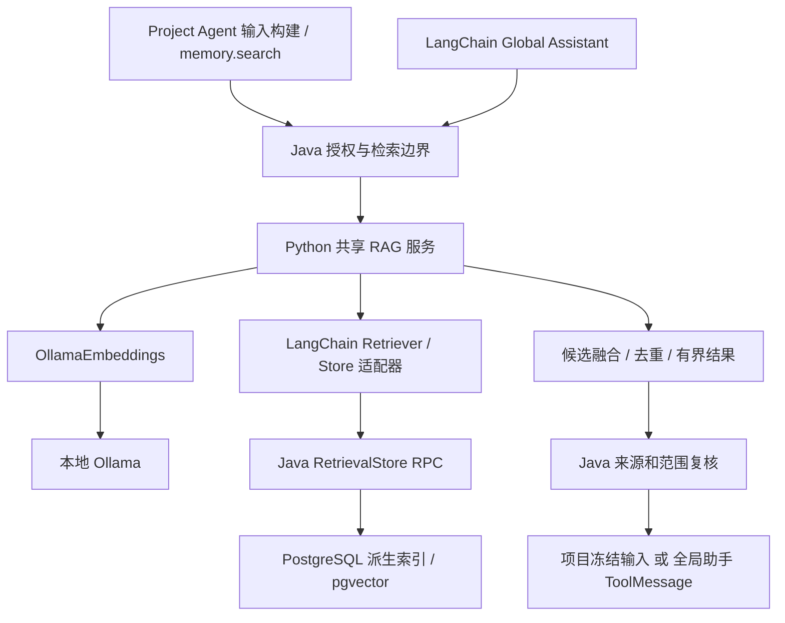

# 统一 Python RAG 与本地 Embedding 设计

> 日期：2026-10-01（Asia/Shanghai）
> 状态：目标设计 / 范围调整；未在本次实现业务代码。
> 方向：Java 负责业务事实、权限及存储，Python LangChain 负责 Agent 与 RAG 算法；项目 Agent、全局助手共用一个 RAG 服务。
> 实施起点：并入正在进行的阶段 0 契约工作，不重做已经完成的全局助手框架验证。

## 1. 为什么统一

已有项目 RAG 在 Java；新全局助手准备采用 Python LangChain。如果再实现 Java Ollama provider，同时在 Python 做另一套 embedding/检索，模型配置、索引版本与效果评估会分裂。

本设计调整此前“Java 执行真实 embedding，Python 只包装现有检索器”的方案：**RAG 算法逐步迁入 Python，真实 Ollama embedding 只在 Python 实现一次。** Java 保留授权内容投影、候选查询 SQL、索引持久化、任务管理、最终来源校验和冻结上下文。这个分工允许多用 LangChain，又不让 Python 重写路线规则或直接读取业务数据库。

本文在 RAG/embedding 职责与迁移顺序上优先于 `GLOBAL_ASSISTANT_LANGCHAIN_REDESIGN.md` §12 的旧迁移选择；该文档其他 Agent、工具、交互、checkpoint 与公开事件设计继续适用。`AGENT_MEMORY_RAG_V1_IMPLEMENTATION.md` 描述的是已有基线，不能把基线说成尚不存在。

本次仅改变架构目标；旧 Java RAG 在切换前仍服务生产，不立即删除。不可变 Answer、canonical shared identity、路线隔离和 frozen-input replay 全部保持。

## 2. 明确决定

| 项目 | 首期决定 |
|---|---|
| RAG 流程所有者 | 同一个 agent-brain 服务内的独立 Python `retrieval` 模块 |
| 全局助手 | Python LangChain Agent 调用共享 RAG |
| 项目 Agent | Java 在首次投影/显式 memory.search 时调用同一个共享 RAG，结果核验后进入冻结输入 |
| Embedding 实现 | Python `langchain_ollama.OllamaEmbeddings` 直接调用受控本地 Ollama |
| 默认模型 | 已有 `qwen3-embedding:0.6b`；`qwen3-embedding:4b` 为评估候选，不自动切换 |
| 向量存储 | 复用 PostgreSQL pgvector 与派生检索存储，不新增 Chroma |
| 数据库访问 | Java 管理；Python 通过受控 store RPC 使用索引，不给其生产数据库连接 |
| 混合检索 | 保留 lexical/trigram/graph/vector 通道；RRF/排序流程迁 Python，SQL 候选查询留 Java |
| 来源与权限 | Java 生成 scope 授权并在返回前重新验证，不靠模型/相似度决定 |
| 聊天模型 | 沿用 Java 模型 broker；本地 embedding 不意味着聊天模型也改为本地 |
| 首期额外模型 | 不强制增加 reranker、查询重写、总结器 |

这里的“统一”是一个实现、一个 profile、一个索引版本规则，有不同授权 scope；不是把产品帮助、所有项目和所有路线混进一份无限制上下文。

## 3. 现有能力与可复用代码

当前代码存在：

- `retrieval_entries` 与 V40/V41 migration，pgvector/pg_trgm/tsvector 基础。
- `RetrievalSourceProjector` 与 IndexPort，对 Node/Answer/Patch/Claim/Resource 生成来源投影。
- `ResourceChunker`，资源分块及位置元数据。
- `HybridRetriever`，词法/trigram/graph/optional-vector + RRF。
- `RetrievalContextService`、`RetrievalSearchService`，有界上下文和显式检索。
- `MemorySearchCapability`，已绑定 project 的只读检索能力。
- `AgentInputSnapshotBuilder`，检索结果进入首次冻结的模型输入。
- `EmbeddingGateway`，noop/fake；尚无真实生产 embedding provider。
- `EmbeddingEnrichmentWorker`，向量增强与业务写入分离。

这些是迁移资产。应复用数据库、索引身份、范围逻辑及测试，不建第二套 Graph 记忆，不把旧 Java 算法和新 Python 算法长期同时用来生成同一份项目检索结果。

## 4. 目标架构



Java 不再维护 RAG 决策/融合循环；Python 不建立业务事实或权限副本。Store adapter 是框架与现有存储的接口桥，不是另一套 Agent/RAG 引擎。

## 5. 职责表

| 工作 | Java | Python / LangChain |
|---|---|---|
| 读取 Node/Answer/Route 等事实 | 唯一执行 | 不查询这些表 |
| lineage、canonical Answer 与 authority 判定 | 唯一执行 | 使用宿主给出的结果 |
| 脱敏/允许索引内容/删除撤销 | 校验和持久化 | 不自行扩大范围 |
| 非结构化内容切分 | 接收并验证位置/版本 | loader + splitter，逐步替换纯文本 ResourceChunker |
| embedding/query embedding | 不实现真实模型调用 | OllamaEmbeddings，文档/查询共用 profile |
| lexical/trigram/graph 候选 SQL | 执行已有查询 | 请求有界候选 |
| pgvector 查询/写入 | 执行并验证 profile/权限 | 生成查询向量/文档向量 |
| RRF、算法去重、候选排序 | 切换后不再实现融合 | 共享 retriever pipeline |
| scope/authority/source 最终准入 | 权威闸门 | 不把分数提升为权限 |
| 可见资料引用 | 校验身份/版本/链接 | 组织有来源结果 |
| 索引任务、租约与重试记录 | 持久化管理 | 执行已 claim 的任务 |
| 模型聊天与凭证 | 原有 broker | Agent 使用 broker |

Java 保留范围筛选和有界投影是产品业务职责。项目 mandatory lineage 上下文不可被向量 Top-K 替代；RAG 只是补充已授权来源。

## 6. 入库流程

```text
业务对象提交
→ Java 生成 source identity/version/hash 与授权文本投影
→ 保存派生记录 / 索引任务（业务事务不等待 Ollama）
→ Java claim 并派发有界任务给 Python
→ Python 切分允许的非结构化内容，批量 embed_documents
→ 返回 chunk 位置、profile、向量与 checksum
→ Java 核验来源仍存在/版本仍匹配、任务仍有效
→ 原子写入新索引 generation，撤销旧 generation
```

Node/Answer/Claim 等已结构化文本优先保持原有来源粒度；不因使用 text splitter 把一条不可变 Answer 的身份改成多条业务事实。资源切片使用 source identity + source version + chunk position，宿主派生 ID；chunk offset 必须指向允许投影文本，不能任意拼出处。

索引任务绑定 jobId、epoch、source/version/hash、profile、batch limit，具有 claim/lease/CAS；重复结果幂等。内容版本已改变则拒绝旧结果。UNAVAILABLE/FAILED 条目按明确调度策略重试；embedding 重试仅限可重做的派生计算，不能触发 Graph 写操作。

复用现有 embedding worker 的宿主调度职责，迁移其“生成向量”调用到 Python。Python 不另起不受管理的生产全库扫描循环。

## 7. 检索流程与接口

Java 生成受控 RetrievalRequest：requestId、workloadId（run/context/index job）、scopeGrant、query、limits、profileId、indexGeneration、deadline。scopeGrant 引用宿主保存的项目/路线/sourceRefs/授权范围与版本，Python 不能用自报用户/projectId 取代它。

Python 执行：

1. 使用固定 profile 做 `embed_query`，不通过模型猜测 scope。
2. 向 Java store 请求允许范围内的 lexical/trigram/graph/vector lanes，可合并为一次有界 RPC。
3. 融合排名、去重和截取；保留 lane、来源 ID、位置、版本与 authority 标签。
4. Java 对最终来源再核验范围、生命周期与版本，按产品规则准入和生成链接。
5. 返回有界 excerpts/sourceRefs/warnings，交给项目输入构建或全局助手。

原先 source tier/authority 优先规则保持为确定性契约，不能由可学习评分取代。Python 可以按已验证标签排序；Java 对违反范围/层级的结果拒绝而不是暗中重新运行一套检索引擎。

建议内部路由（尚未实现，阶段 0 固化）：

| 方向 | 接口 | 功能 |
|---|---|---|
| Java → Python | `/internal/v1/retrieval/search` | 统一检索，返回有界候选 |
| Java → Python | `/internal/v1/retrieval/index-batches` | claim 后的分块与向量计算 |
| Java → Python | `/internal/v1/retrieval/health` | profile、Ollama 就绪、容量与版本信息 |
| Python → Java | `/internal/v1/retrieval-store/candidates` | 按 scopeGrant 执行现有 SQL 通道 |
| Python → Java | `/internal/v1/retrieval-store/validate-sources` | 可选最终引用核验；也可由原 Java 调用方统一完成 |

DTO 使用独立版本 `retrieval.v1`，不改变 agent-input.v2。所有入口认证、绑定工作负载和失效时间，限制向量/文本/批次大小，避免递归调用。Python store RPC 必须调用低层候选服务，不回调 memory.search/RemoteRetrievalService 本身。

Java 使用 LangChain 不适用；Python 实现自定义 BaseRetriever/VectorStore 或组合 runnable 来适配现有授权存储。不要直接让通用 PGVector 集成连接业务库并建平行索引表。已有 pgvector 表仍是存储资产，并不要求每个 SQL helper 都换成框架组件。

## 8. 两个 Agent 怎样共用

### 项目 Agent

首次 ContextSnapshot 投影：Java 确定 mandatory lineage/允许 scope → 共享 Python RAG → Java 校验补充来源 → 冻结最终 AgentInputSnapshot。后续同 snapshotId 回放已冻结 payload，不重检索、不重嵌入、不受新模型 profile 影响。

`memory.search` 仍通过 CapabilityRuntime 执行，调用统一远程检索边界。既有 PROJECT/ROUTE/RESOURCE authority 标签与跨路线证据规则原样保留；本文不修改项目记忆的有效性语义。

### 全局助手

新增 `help.search`（产品帮助）、项目内容发现入口和既有 project-bound memory.search 适配；在宿主生成的 application/project scope 下共用同一 RAG 服务。

跨项目发现返回分组线索，选定目标后才构建该项目的具体回答上下文；不把多个项目/路线结论混写。帮助资料使用独立 corpus identity，索引内容为受控用户说明，不索引内部凭证/指令文件。

两类入口共用 profile/config/job/search/validation；不同 corpus、项目和路线是同一服务中的隔离范围，不是第二套 RAG。

## 9. 本地模型选择

本机只读检查：16 GiB 系统内存，RTX 4060 Laptop GPU；nvidia-smi 报告总显存约 8 GiB。未测试模型运行速度，显存总量不是当前可用量。

| 候选 | 本项目建议 |
|---|---|
| `qwen3-embedding:0.6b` | 首期默认，学习项目已有配置；先完成统一架构与中文检索基线 |
| `qwen3-embedding:4b` | 优先对照候选；在本机运行相同数据集，比较召回与冷/热延迟、显存峰值 |
| `qwen3-embedding:8b` | 本轮不默认引入，避免更大资源竞争；不能因参数更多直接认定最佳 |
| BGE-M3 | 可选对照，不主动替换；本轮仅需 dense + 已有 lexical，不能把原模型 sparse/ColBERT 能力误认为通用 Ollama embedding 接口都会暴露 |

[Ollama 模型页](https://ollama.com/library/qwen3-embedding) 列出 Qwen3 0.6B/4B/8B tag；当前页面模型文件约 639MB/2.5GB/4.7GB，**文件大小不等于推理显存占用**。Qwen 发布者的 [模型卡](https://huggingface.co/Qwen/Qwen3-Embedding-0.6B) 报告 C-MTEB 检索分数 0.6B=71.03、4B=77.03、8B=78.21；这支持将 4B 列为候选，不证明量化后的 Ollama 版本在本项目中一定更好。

首期维持 0.6B，不下载/切换新模型。本地 Ollama 地址从部署配置取得，现有学习地址 `http://127.0.0.1:11434`。仅调用允许的本地服务，不自动使用 Ollama 云模型或公网 embedding；Docker 需配置实际可达宿主地址。

采用 [LangChain OllamaEmbeddings](https://docs.langchain.com/oss/python/integrations/embeddings/ollama) 的文档/查询接口，锁定依赖。校验服务版本与 batch、truncate、dimensions 支持；不同 Qwen 文档/查询指令、normalization 和维度策略属于 profile，必须遵循模型规则并实测，不能只修改 model 字符串。

profile 含 provider、model tag/digest、dimensions、query/document 编码策略、normalization、splitterVersion、index schema/version。模型相同 tag 更换内容也必须识别。向量重建到新 generation，验证后原子切换，不混入不同 profile。

## 10. 可靠性与预算

Java 为共享 RAG 授权和限额；Python 有独立 embedding 并发/批大小限额，避免后台入库占满 GPU 影响查询。冷启动、索引批处理与在线查询分别计时。自动快照构建不等待全项目向量回填。

Ollama 不可用时，以相同远程检索服务的 lexical/trigram/graph 通道返回结果，并明确 vectorUnavailable；如果用户要求纯语义查询则报告不可用，不偷偷换模型。Python 服务不可用：全局助手检索工具明确失败；项目首次投影按契约使用 mandatory canonical context，并记录 supplementalRetrievalUnavailable，不伪造检索结果；已有冻结输入照常回放。实现前需在项目 context 契约中固化这一可选补充语义。

后台任务可重复派发，但回写需 CAS；未知来源/不支持 profile/缺失 scope/旧 epoch fail closed。索引删除与权限变更即时影响 store 查询，不等待向量重建。清理旧 generation 使用可核验任务，不删除 canonical 来源。

不增加默认 reranker/LLM query rewrite/LLM 文档总结。先用原文有界片段生成回答，后续仅针对已测出的召回/排序问题引入额外模型，并记录预算。

## 11. 迁移清单与顺序

| 现有 Java 模块 | 最终处理 |
|---|---|
| RetrievalSourceProjector / IndexPort | 保留 source 事实投影/变更通知；纯分块部分逐步委托 Python |
| RetrievalEntryRepository | 保留 SQL/持久化/CAS，扩展 scoped store RPC |
| HybridRetriever / VectorCandidateRetriever | Python pipeline 接管算法；完成 parity 后退役生产调用 |
| EmbeddingGateway / Noop / Fake | 迁移期保留旧测试兼容；真实 provider 不另写 Java Ollama 实现 |
| EmbeddingEnrichmentService/Worker | 宿主任务/状态保留，向量计算委托 Python；不并跑两个真实增强 worker |
| RetrievalContextService / RetrievalSearchService | 收缩为授权/远程调用/校验/有界 DTO 投影 |
| AgentInputSnapshotBuilder | 保留 mandatory facts 和首次冻结，只替换可选检索调用 |
| MemorySearchCapability | 保留能力与授权入口，内部调用统一服务 |

**U0（现在，阶段 0 增量）**：固化本文职责、profile、search/index/store DTO、范围与失败行为；继续已有全局助手 LangChain/model 契约验证。不要在阶段 0 新增 Java 真 embedding provider。

**U1（统一检索基础）**：实现 Python shared retrieval + OllamaEmbeddings、Java store/任务桥接，保留 pgvector。先运行同一数据集的新旧算法 parity 和真实语义查询；不双跑业务写操作。

**U2（项目 RAG 切换）**：迁移 memory.search 和首次快照补充检索，验证 frozen replay/来源隔离；新请求记录 retrievalEngineVersion/profile/generation。切换后 Java 旧融合算法无生产调用，旧 source 数据与冻结输入兼容。

**U3（全局助手使用）**：接入产品帮助与内容发现，两个 Agent 均调用同一服务；原全局助手阶段 1 框架迁移可先完成，RAG 功能按 U1–U3 门禁交付。

**U4（质量升级）**：比较 0.6B/4B，结果证明改进且资源预算允许才切模型并重建索引。无证据不升级；reranker 单独评估。

回滚只改变新请求的显式 retrievalEngineVersion，不能改写已冻结模型输入。旧引擎保留到切换验收完成，不作为不可见双重检索 fallback 长期存在。

## 12. 验收与开发交接

- 统一性：生产只有一个真实 embedding 实现和一套检索融合；两个 Agent 共享同一服务/config/profile。
- 行为：exact-name、中文改写、同义表达、资源定位、零命中、跨项目候选、不相关资料。
- 业务不变量：mandatory lineage 不丢、shared Answer 身份不变、跨路线标签与范围不变、来源未确认不晋升 confirmed。
- 存储：修改/删除/撤销来源、旧 hash 回写、并发索引、profile 切换、中断/CAS/任务 replay。
- 快照：已有 projection 完全回放；换模型/重建索引不会影响旧 snapshot。
- 可用性：Ollama 停止、Python 断连、超长文本、向量非有限/维度错、GPU 竞争与冷启动。
- 质量：至少 50 条覆盖项目真实中文表达的 query/source 对照；记录 Recall@K、MRR 或等价排序指标、有效来源率、零命中正确性、P50/P95 与资源峰值。开发阶段这些是待验证指标，不宣称已测得。
- 模型对比用独立 index generation，记录 tag/digest；公开 benchmark 不替代本项目评估。

给正在做阶段 0 的会话追加：

```text
RAG/embedding 设计已统一，请读取 docs/v2/UNIFIED_PYTHON_RAG_DESIGN.md。
继续已完成的全局助手阶段 0，不重做框架验证。
RAG 算法与真实 Ollama embedding 迁入同一个 Python retrieval 模块，
项目 Agent 与全局助手共用；Python 用 OllamaEmbeddings，首期 qwen3-embedding:0.6b。
Java 保留业务投影、权限、pgvector 存储/RPC、任务管理和最终来源校验。
不要再新增 Java OllamaEmbeddingGateway 或第二套 Chroma/向量索引。
将 shared search/index/store 契约并入阶段 0，按 U1–U3 迁移现有项目 RAG。
qwen3-embedding:4b 是后续对照候选，评估后再切，不自动下载或切模型。
```

本文件完成的是设计整合，不代表阶段 0/U1 已完成。实施时同步边界/合同，按用户授权推进开发；本轮不安装模型、不改数据库、不动另一会话的业务代码。


### 2026-10-02 实施契约补充（未生产切换）

共享服务增加 `/internal/v1/retrieval/source-chunks`，请求必须引用宿主已持久保留的
INDEX_JOB / grant / lease / sourceVersion。Python 在处理前经认证宿主
`/internal/v1/retrieval-store/projection-grants` 核验完整输入，不能自报授权范围。
Java 只保留业务 raw projection 并调度任务；Python 独占分块算法；结果按原始 UTF-16
连续位置/字节 hash 和 canonical node/来源版本 CAS 回写既有 retrieval_entries。
原始投影任务表仅存等待计算的业务来源，不参与候选 SQL，没有另一套索引。

项目 snapshot metadata 新增可选 retrieval 状态：engine/profile/generation/vectorUnavailable/
supplementalRetrievalUnavailable。缺失字段继续兼容旧冻结输入；首次失败只影响补充检索，
mandatory lineage 不丢失。后续读取同 snapshotId 回放冻结 payload，不因索引/profile/服务恢复而重检索。
默认引擎仍 `java-hybrid.v1`，明确 opt-in 为 `python-rag.v1`；整体门禁见实施记录。


## 2026-10-02 U1–U3 实施补充

目标算法已有一份 Python 实现，按显式 python-rag.v1 接入两类 Agent；默认
生产引擎仍保持原设置。Node/Answer/Claim 按业务单位投影，资源和产品帮助
经授权 projection-grants → Python 原文分块 → 宿主原子提交，再经 index-grants
→ 同一 Ollama profile → 原 retrieval_entries/pgvector → CAS。HELP 的来源限于
随包发布的三个文档，与项目授权范围隔离；不接受任意路径/URL/数据库。
Java 核对规范来源的内容、身份和 authority，派生索引本身不证明事实已确认。

全局助手新增 help.search / project.content.discover，均为只读 NONE 能力；后者
显式项目只查该项目，无项目时最多四个最近项目，每项目最多 8 项/4000 字符。
目录由原宿主注册表冻结；Java/Python 上限同步 12，当前全目录 10 项。
保留 6 模型/5 工具/180 秒预算。原生模型忽略 parallel_tool_calls=false 时，仅
允许多个已准入只读业务工具；写入、导航和提问批次在派发前拒绝。

项目侧必要上下文由 Runtime 保证，补充检索失败进入首次冻结 metadata；旧
冻结输入直接回放。AgentContracts 对嵌套 map 排序，使跨 JVM 传输稳定，不
改写任何已保存输入/Answer/Graph。共享路径不截断已核验片段并沿用旧 hash。

检索距离阈值由 Python CandidateRequest 发出，Java 仅执行有界 SQL primitive。
默认 0.50 是当前 fixture 校准结果，不能称独立测试集验收。52 条 AI 编写、待
人工审阅的 query/source 已真实运行，详细指标与采样界限见实施记录/证据。
有效权限/版本核验已验证，人工标注门槛仍不通过。0.6B 的 tag/digest/profile
保持不变；未下载 4B、未引入 reranker/额外反思模型。
